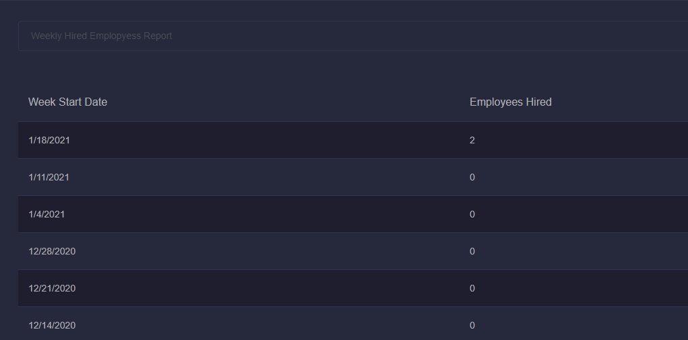
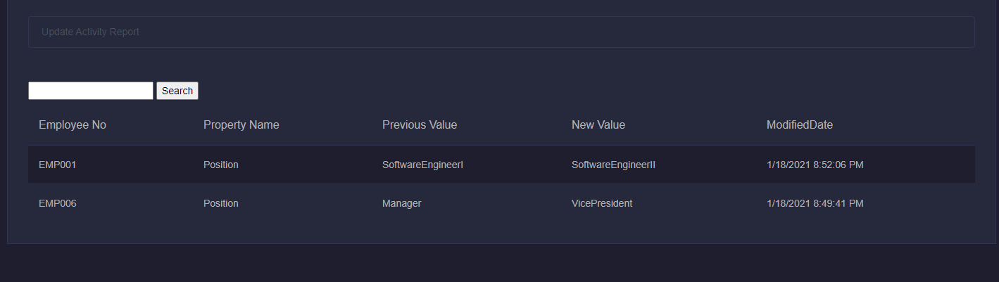
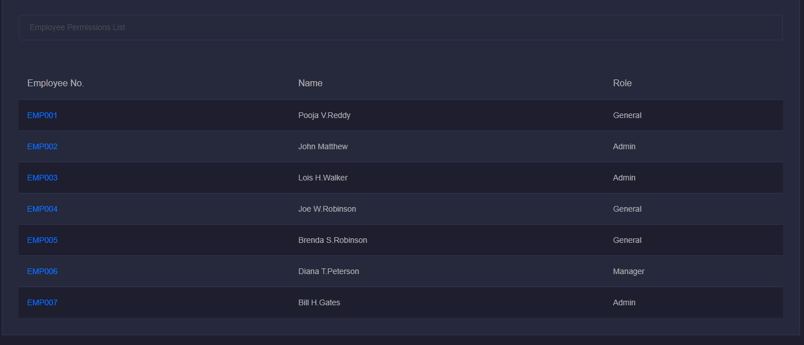

# Team Management Web App

## Running the Site Locally

1. update appsettings.json with database server and database name.       

2. run the solution using F5(IIS Express).   
   database gets created when the application runs for the first time and seeding sample data using json file.
   
### Technical Stack

1. .NET Core Version 3.1  
1. SQL server  
1. Entity Framework Core
1. bootstrap and font-awesome libraries for UI.

  

## Employee CRUD operations

  

### View All Employees

From left index, navigate to All employees. All employees details will be displayed.
for each employee, there are 3 actions - 

#Edit#, Detail, Delete which can be clicked to Update Employee Details, View Employee Details and Delete Employee respectively.

#### grid operations
1. Employees can be searched using Employee Number.
1. Grid can be Sorted using Number or Full Name.

  

### Add New Employees

Click on New Employee link from the above page or from the left menu.  
Enter all the details. EmployeeNo can begin with EMP for easy identification.

  

## Reports

  

### Weekly Hired Numbers

Click on Weekly Hired from left menu. it shows the last 24 weeks of data. designed it to be like a table instead of drop down as typical reports show either table or time series line graph. 

  

### Terminated Employees

Click on Terminated from left menu. it shows the terminated counts per year.

  

### Activity Tracker

Click on Activity Report from left menu. we are tracking the updates made to employee record for the 3 fields - Position, Role and ManagerId.   
Go to All Employees and update any employee records for any of those 3 fields and see the record here.

  

### Employee Permissions

Click on Permissions from left menu to see Security Roles of all employees. To make the design simple keeping the ability to have one role only.  
Ideally in real world system person gets added to lots of Security groups and Roles in Active Directory. 

